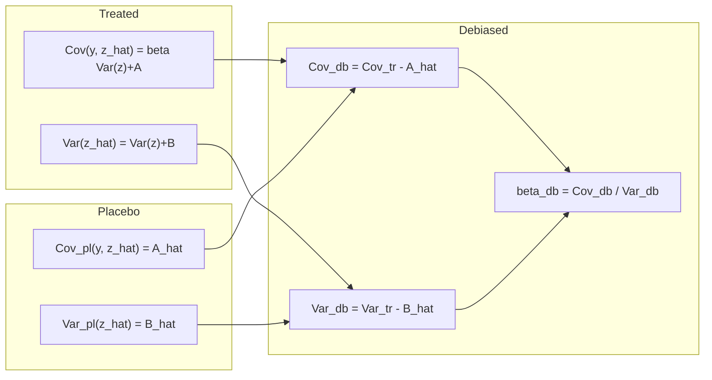
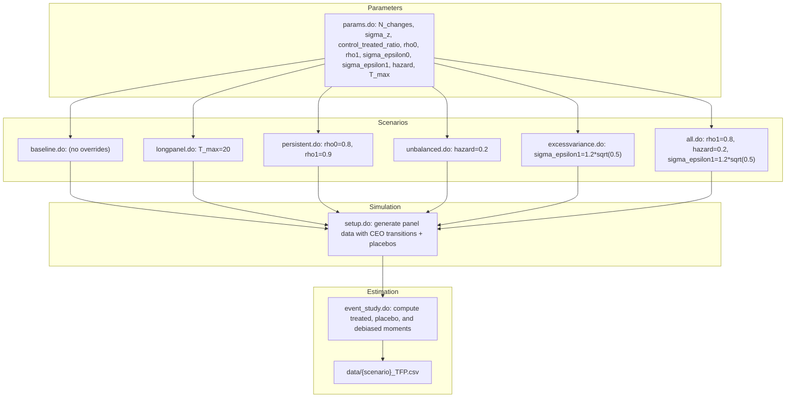
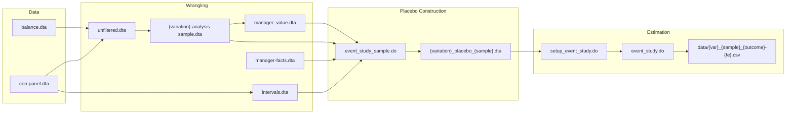

# Placebo-Controlled Event Study Design

## Overview

The placebo-controlled event study design is a novel method for debiasing second moments of estimated CEO effects—variances, covariances, correlations, and event-study dynamics—that are systematically inflated by small-sample noise. The central insight is to construct **placebo CEO transitions** (fake transitions that replicate the spell-length design of actual transitions in matched firms that undergo no real change) and compute the same moments on these placebos. Because placebo firms have no true CEO effect, their moments nonparametrically estimate the bias components. Subtracting placebo moments from treated moments yields debiased estimates.

This design is implemented across three layers:

- **Construction**: `lib/create/event_study_sample.do` generates placebo samples via exact matching on cohort, sector, and firm size category.
- **Estimation**: `lib/estimate/event_study.do` and `lib/estimate/setup_event_study.do` compute treated and placebo moments, produce debiased slopes, and export results.
- **Validation**: `lib/create/montecarlo.do` and `papers/econometrics/src/montecarlo/` provide a modular Monte Carlo framework with six scenarios that isolate when the correction matters.

## Placebo Matching Logic

### Exact matching variables

Placebo transitions are constructed by exactly matching each treated firm transition to control firms on three variables (`$exact_match_on`):

```
global exact_match_on cohort sector max_size
```

- **`cohort`**: Firm birth cohort (year of registration).
- **`sector`**: Two-digit industry classification (TEAOR08).
- **`max_size`**: Firm size category over its lifetime (1 = ≤5 employees, 2 = >5 employees).

The matching also conditions on the event-window geometry—`window_start`, `window_end`, and the event time `t0` of the treated transition.

### Matching algorithm

<!-- openwiki: mermaid parse failed and this diagram was converted to a text fence so it does not break rendering. Fix the diagram source and restore the mermaid fence. Parser error: Heuristic: an unescaped angle bracket inside a label breaks rendering; rephrase the label. -->
```text
flowchart TD
    A["treated firms with actual CEO transitions"] --> B["collapse to (cohort, sector, max_size, window_start, window_end, t0) groups"]
    B --> C["count N_treated per design group"]
    C --> D["all potential control firms: all firm-spells with no transition in window"]
    D --> E["joinby exact_match_on + window geometry constraints"]
    E --> F["keep controls with window_start1 <= window_start and window_end1 >= window_end"]
    F --> G["sample controls with probability p = MULTIPLE * N_treated / n_control"]
    G --> H["assign placebo t0 from treated distribution (sampled proportionally)"]
    H --> I["compute weight = N_treated / n_control for reweighting"]
    I --> J["append treated firms and save"]
```

The target control-to-treated ratio is set by `TARGET_N_CONTROL = 10` and the expected mean treated group size `MEAN`. The sampling probability per control is:

```
MULTIPLE = TARGET_N_CONTROL / MEAN
p = MULTIPLE * N_treated / n_control
```

This ensures the expected number of selected controls equals `TARGET_N_CONTROL` times the number of treated groups. After sampling, weights are set to `weight = N_treated / n_control` to rebalance to the treated distribution.

### Placebo timing

For each selected control, the `t0` (event time of transition within the window) is assigned by sampling from the treated distribution of `t0` values:

```stata
forvalues t = 1/`T' {
    replace p = cond(missing(t0), n_treated`t' / N_treated, 0)
    replace t0 = `t' if missing(t0) & uniform() <= p
    replace N_treated = N_treated - n_treated`t'
}
```

This ensures placebo transitions replicate the timing distribution of treated transitions within each design group. The change year is then `change_year = window_start + t0`.

## Key Parameters in `event_study_sample.do`

| Parameter | Value | Purpose |
|-----------|-------|---------|
| `TARGET_N_CONTROL` | 10 | Desired number of controls per treated group |
| `SEED` | 1391 | Random seed for reproducibility |
| `min_obs_threshold` | 1 | Minimum observations before/after transition |
| `min_T` | 1 | Minimum observations to estimate fixed effects |
| `max_n_ceo` | 2 | Maximum number of CEOs per firm for analysis |
| `exact_match_on` | cohort sector max_size | Variables for exact matching |
| `fixed_effect` | ROA | Fixed effect variable for within-spell means |

## Sample Definitions (13 samples)

The `event_study_sample.do` accepts 13 mutually exclusive (but not exhaustive) sample definitions, each specified as a local macro condition applied at line 115:

| Sample | Condition | Purpose |
|--------|-----------|---------|
| `full` | (no restriction) | All firms meeting quality filters |
| `fnd2non` | `has_founder1 == 1 & has_founder2 == 0` | Founder CEO replaced by non-founder |
| `non2non` | `has_founder1 == 0 & has_founder2 == 0` | Non-founder replaced by non-founder |
| `small` | `max_size == 1` | Firms with ≤5 employees |
| `large` | `max_size == 2` | Firms with >5 employees |
| `one2one` | `n_ceo1 == 1 & n_ceo2 == 1` | Exactly one CEO per spell |
| `twos` | `n_ceo1 == 2 or n_ceo2 == 2` | At least one spell with two CEOs (co-CEOs) |
| `gap` | `one2one` and `age_diff > 10` | Large age gap between departing and incoming CEO |
| `nogap` | `one2one` and `age_diff <= 10` | Small age gap |
| `gender` | `n_ceo_male1 != n_ceo_male2` | CEO gender change |
| `nogender` | `n_ceo_male1 == n_ceo_male2` | No CEO gender change |

These are defined as named locals at the top of `event_study_sample.do` and validated against the `valid_samples` list.

## Analysis Variations (4 types from `filter.do` and Makefile)

`lib/util/filter.do` and the Makefile define 7 analysis variations, applied before placebo construction as sample filters:

| Variation | Condition | Purpose |
|-----------|-----------|---------|
| `full` | (no filter beyond quality) | All firms |
| `size1` | `employment <= 5` | Micro firms |
| `size2` | `employment > 5 & employment <= 10` | Small firms |
| `size3` | `employment > 10 & employment <= 25` | Medium-small firms |
| `size4` | `employment > 25` | Medium-to-large firms |
| `pre2000` | `year <= 2000` | Pre-2000 observations |
| `post2000` | `year > 2000` | Post-2000 observations |

These are listed in the Makefile as `ANALYSIS_VARIATIONS := full size1 size2 size3 size4 pre2000 post2000`. The `SAMPLES` list contains the 9 sample definitions used in estimation: `full one2one twos fnd2non non2non gender nogender gap nogap`.

The Makefile generates all 7 × 9 = 63 placebo datasets via a `foreach`-generated rule chain:

```makefile
$(foreach variation, $(ANALYSIS_VARIATIONS), $(foreach sample, $(SAMPLES), $(eval $(call GEN_PLACEBO,$(variation),$(sample)))))
```

## Bias Decomposition (Econometric Framework)

The econometric framework formalizes why second moments of estimated CEO effects are biased and how placebo moments remove that bias.

### Model

Let firm \( i \) in year \( t \) have outcome:

\[
y_{it} = z_{m(i,t)} + e_{it}
\]

where \( z_{m(i,t)} \) is the manager effect (piecewise constant within CEO spells) and \( e_{it} \) is a mean-zero shock orthogonal to the manager path ("random mobility").

Stack event-time into vectors: \( \mathbf{y}_i = \mathbf{z}_i + \mathbf{e}_i \). For a linear contrast with weights \( \mathbf{w} \), define \( y_i = \mathbf{w}'\mathbf{y}_i \), \( z_i = \mathbf{w}'\mathbf{z}_i \), and \( \varepsilon_i = \mathbf{w}'\mathbf{e}_i \).

### Within-spell mean projection

Estimated effects are within-spell means. Let \( \mathbf{D} \) map event-time observations to spells and \( \mathbf{T} \) be diagonal with spell lengths. The projection matrix is:

\[
\mathbf{P} = \mathbf{D}\,\mathbf{T}^{-1}\mathbf{D}'
\]

yielding:

\[
\hat{\mathbf{z}}_i = \mathbf{P}\,\mathbf{y}_i = \mathbf{z}_i + \mathbf{P}\,\mathbf{e}_i,\qquad
\hat{z}_i = \mathbf{w}'\hat{\mathbf{z}}_i = z_i + \eta_i,\ \eta_i = \mathbf{w}'\mathbf{P}\,\mathbf{e}_i
\]

### Bias components

Two bias components govern moments involving \( \hat{z}_i \):

\[
A := \text{Cov}(\varepsilon_i, \eta_i) = \mathbf{w}'\boldsymbol\Sigma\,\mathbf{P}\,\mathbf{w},\qquad
B := \text{Var}(\eta_i) = \mathbf{w}'\mathbf{P}\,\boldsymbol\Sigma\,\mathbf{P}\,\mathbf{w}
\]

where \( \boldsymbol\Sigma \) is the shock autocovariance in the window. Then:

\[
\begin{aligned}
\text{Cov}(y, \hat{z}) &= \beta\,\text{Var}(z) + A \\
\text{Var}(\hat{z}) &= \text{Var}(z) + B
\end{aligned}
\]

### Slope bias

The regression slope of \( y \) on \( \hat{z} \) is:

\[
\tilde\beta = \frac{\beta\,\text{Var}(z) + A}{\text{Var}(z) + B}
= \beta + \frac{A - \beta B}{\text{Var}(z) + B}
\]

With i.i.d. shocks and balanced spells, \( A = B \) and \( \tilde\beta = \beta \) even though \( \text{Var}(\hat{z}) \) is inflated. With persistent shocks or short/unbalanced spells, \( A \neq B \), generating spurious pre-trends and slope bias.

## Placebo Identification of Bias

For placebo firms, there is no true CEO transition, so \( \text{Var}(z) = 0 \). Therefore:



Under the identifying assumption that the shock autocovariance is the same up to a scalar multiplier across treated and placebo groups (within design cells), subtraction recovers:

\[
\begin{aligned}
\widehat{\text{Cov}}^{\,db}(y, \hat{z}) &= \widehat{\text{Cov}}^{\,tr}(y, \hat{z}) - \hat{A} \\
\widehat{\text{Var}}^{\,db}(\hat{z}) &= \widehat{\text{Var}}^{\,tr}(\hat{z}) - \hat{B} \\
\hat{\beta}^{\,db} &= \frac{\widehat{\text{Cov}}^{\,tr}(y, \hat{z}) - \hat{A}}{\widehat{\text{Var}}^{\,tr}(\hat{z}) - \hat{B}}
\end{aligned}
\]

### Allowing scalar heterogeneity

The draft paper allows for groupwise scalar heterogeneity across design groups (defined by spell-length patterns) using multiplicative Poisson pseudo-maximum likelihood or a two-step regression that loads on the placebo bias term. This adjustment accounts for situations where the shock variance differs between treated and placebo groups by a common scalar multiple within each design cell.

## Monte Carlo Framework

The Monte Carlo study validates the placebo correction under six scenarios. The framework is modular:



### Core simulation structure (`setup.do`)

The setup script (`papers/econometrics/src/montecarlo/setup.do`) expects parameters and generates:

1. **Firms**: `N_changes` treated transitions (default 50,000 in `params.do`).
2. **Spell lengths**: If `hazard == 0`, balanced spells with `T1 = T2 = T_max`. Otherwise, `T1 = ceil(Exponential(1/hazard))`, `T2 = ceil(Exponential(1/hazard))`, both truncated at `T_max`.
3. **Placebo expansion**: Each treated firm is expanded to `1 + control_treated_ratio` copies (default 1:1 ratio). The `placebo` flag distinguishes treated (0) from controls (1).
4. **Shocks**: AR(1) process with group-specific parameters:

```stata
generate lnR = rho0 * lnR[_n-1] + dlnR  // placebo
generate lnR = rho1 * lnR[_n-1] + dlnR  // treated
```

5. **Manager effects**: Draw `dz ~ N(0, sigma_z^2)` and add to post-change `lnR` for treated firms only.
6. **Measured skill**: Within-spell mean of `lnR`, demeaned within the treated group.

### Six Monte Carlo scenarios

| Scenario | `rho0` | `rho1` | `hazard` | `T_max` | `sigma_epsilon1` | Purpose |
|----------|--------|--------|----------|---------|------------------|---------|
| Baseline | 0.9 | 0.9 | 0.2 | 5 | 1×√0.5 | i.i.d. within group |
| Long Panel | 0.9 | 0.9 | 0.2 | 20 | 1×√0.5 | More observations per spell |
| Persistent Errors | 0.8 | 0.9 | 0.2 | 5 | 1×√0.5 | Asymmetric AR(1) persistence |
| Unbalanced Panel | 0.9 | 0.9 | 0.2 | 5 | 1×√0.5 | Variable spell lengths |
| Excess Variance | 0.9 | 0.9 | 0.2 | 5 | 1.2×√0.5 | Treated group more volatile |
| All Complications | 0.8 | 0.9 | 0.2 | 5 | 1.2×√0.5 | Combination of all features |

**Qualitative expectations**:
- With balanced spells and symmetric persistence (Baseline, Long Panel), placebo and treated moments align.
- With persistence or unbalanced spells, covariance and variance inflation differ (A ≠ B), creating spurious pre-trends that placebo subtraction removes.
- With excess variance, placebo moments scale proportionally and subtraction remains valid.
- With all complications, biases are largest in naive profiles; debiased profiles recover the target contrast.

### Parameter file (`params.do`)

Contains baseline parameters that scenario scripts override:

```
N_changes          = 50000
sigma_z            = 1.0
control_treated_ratio = 1
rho0               = 0.9
rho1               = 0.9
sigma_epsilon0     = sqrt(0.5)
sigma_epsilon1     = sqrt(0.5)
hazard             = 0.2
T_max              = 5
gamma              = 0
```

The `gamma` parameter (used in `setup.do` as `dz = lnR * gamma + rnormal(0, sigma_z)`) enables a time-trend simulation (`trend.do` sets `gamma = 0.1`).

### Runner script

The runner (`run.do`) chains the stages:

```stata
args scenario
include "src/montecarlo/params.do"
include "src/montecarlo/`scenario'.do"
include "src/montecarlo/setup.do"
save "data/placebo_`scenario'.dta", replace
```

## Pipeline Integration

The placebo design is the central artifact that connects data wrangling to statistical estimation:



### File naming convention

Placebo datasets follow: `temp/{variation}_placebo_{sample}.dta`

For example:
- `temp/full_placebo_full.dta` — all firms, no additional sample restriction
- `temp/size1_placebo_one2one.dta` — micro firms with single-CEO spells
- `temp/post2000_placebo_fnd2non.dta` — post-2000 observations, founder-to-non-founder transitions

### Event study estimation

The estimation pipeline (`setup_event_study.do`) joins the placebo dataset to the analysis sample, aligns in event time (`event_time = year - change_year`), creates treatment indicators (`actual_ceo` and `placebo_ceo`), and computes within-spell manager skill means. The core Stata command `xt2denoise` computes treated, placebo, and debiased beta series (coefficients `beta1`, `beta0`, `dbeta`) along with covariance and variance series.

## Important Invariants and Constraints

1. **Consecutive spells only**: After collapsing to spell-level data, firms with non-consecutive spells or single spells are dropped (line 83 of `event_study_sample.do`).
2. **Spell duplication**: Intermediate spells (between first and last) are doubled so they contribute as both a "before" and "after" observation.
3. **No overlap in fake_id**: Placebo and treated firms have distinct `fake_id` ranges to avoid identification conflicts.
4. **Minimum observations**: Both spells 1 and 2 must have at least `min_T` observations of the fixed effect variable.
5. **CEO count cap**: Firms with more than `max_n_ceo` CEOs per spell are excluded.
6. **Random seed**: Both the placebo construction (`SEED = 1391`) and Monte Carlo (`set seed 2191`) use fixed seeds for reproducibility.
7. **Intermediate spells require multiplicity**: Firms with spells between first and last are expanded by factor 2 to create separate before/after observations for each intermediate transition.

## Safe Change Plan

When modifying the placebo design, ensure:

- **Adding a matching variable**: Update `$exact_match_on` in `event_study_sample.do` and verify the `joinby` in the cohort loop still works with adequate control firms.
- **Changing `TARGET_N_CONTROL`**: Recompute `MULTIPLE` and check that sampling probabilities remain within [0,1].
- **Adding a new sample definition**: Add a local macro in `event_study_sample.do`, append to `valid_samples`, and add to the Makefile's `SAMPLES` list. Verify the condition is mutually exclusive where required.
- **Modifying Monte Carlo parameters**: Only `params.do` and scenario-specific `.do` files need changes; `setup.do` reads all parameters as locals at the top.
- **Adding a new Monte Carlo scenario**: Create a `{scenario}.do` that overrides relevant parameters, add to `run.do` execution, and add to the figure script `figuremc.do`.
