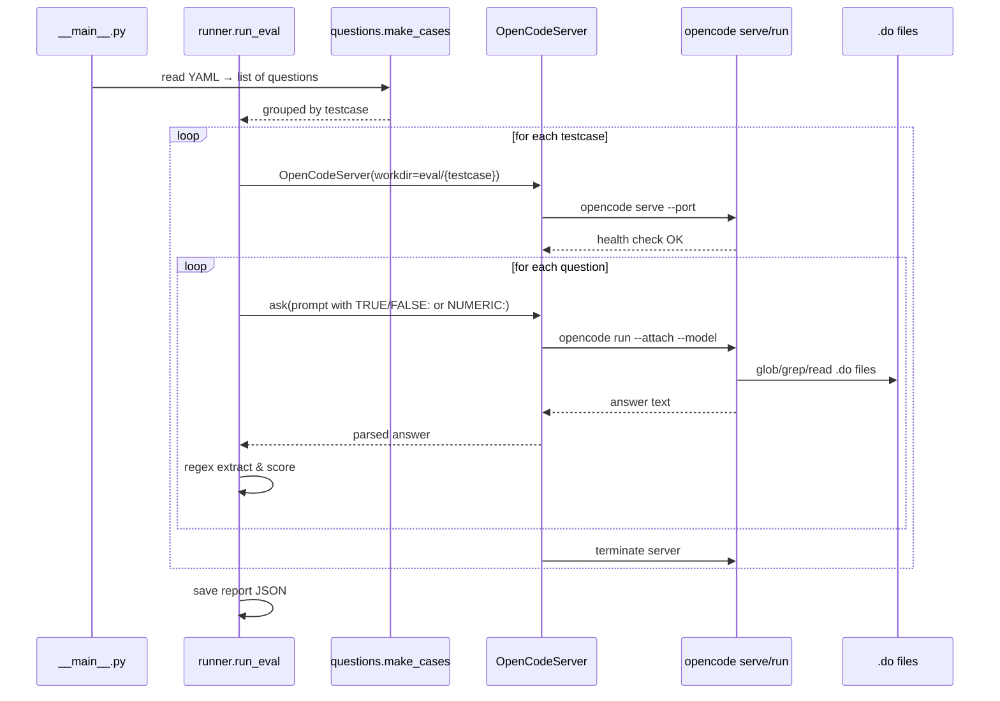

# AI Agent Evaluation Harness

The evaluation harness in [`eval/`](repo://eval/__main__.py) measures an AI coding agent's ability to understand Stata code from the CEO-value research project. It launches a headless [opencode](https://github.com/opencode-ai/opencode) process for each test case, sends a structured prompt containing a question about the surrounding `.do` files, parses the agent's answer from the response, and scores it against a ground-truth rubric.

The harness supports **two question types**:

- **`true_false`** — the agent must answer TRUE or FALSE, prefixed with `TRUE/FALSE:`.
- **`numeric`** — the agent must answer with an integer, prefixed with `NUMERIC:`.

Answers are parsed via simple regular expressions; partial or non-conforming responses are scored as failures.

---

## Architecture and control flow



The harness is composed of five modules:

| Module | Responsibility |
|---|---|
| `schemas.py` | Pydantic data models for questions, test cases, and configuration |
| `questions.py` | Discovers and loads YAML-defined test cases |
| `server.py` | Manages the headless opencode process lifecycle |
| `runner.py` | Orchestrates evaluation, scores answers, saves reports |
| `__main__.py` | CLI entrypoint that parses arguments and invokes `run_eval` |

---

## Data models (`eval/schemas.py`)

[`eval/schemas.py`](repo://eval/schemas.py#L1-L38) defines four Pydantic v2 models:

**`Question`** — a single evaluative question.
- `id: str` — unique question identifier within a test case.
- `type: str` — one of `"true_false"` or `"numeric"`.
- `prompt: str` — the question text sent to the agent.
- `answer: bool | float` — the ground-truth answer (parsed as `truth` in runner logic).
- `rubric: Optional[str]` — human-readable explanation for the expected answer.

**`TestCase`** — a named group of questions sharing a `.do` file environment.
- `name: str`
- `description: Optional[str]`
- `questions: list[Question]`

**`ModelConfig`** — provider-agnostic model endpoint definition.
- `provider: str` — one of `openai`, `openai_compatible`, or `mock`.
- `model_id: str` — e.g. `gpt-4o`, `anthropic/claude-sonnet-4-20250514`.
- `base_url: Optional[str]` — for OpenRouter, Vercel AI Gateway, etc.
- `api_key_env: Optional[str]` — environment variable for the API key.

**`EvalConfig`** — runtime configuration for a single evaluation run.
- `model_id: str` — defaults to `openai/gpt-5.4-mini`.
- `results_dir: str` — defaults to `eval/results`.
- `server_port: int` — port for headless opencode server; `0` means auto-assign.
- `concurrency: int` — max concurrent evaluations (currently serial, reserved for future use).

---

## Test case discovery and loading (`eval/questions.py`)

[`eval/questions.py`](repo://eval/questions.py#L1-L40) discovers test cases by scanning the `eval/` directory for `*.yaml` files. For each YAML file whose stem matches a subdirectory name (e.g. `ceo_overlap.yaml` ↔ `eval/ceo_overlap/`), it loads the file as a `TestCase` and flattens it into a list of question dicts.

**`make_cases(eval_dir="eval")`** returns a list of dicts each containing `name`, `testcase`, `question_id`, `type`, `prompt`, `truth`, and `rubric`. The runner groups these by `testcase` to spawn one server per test case.

---

## Server lifecycle (`eval/server.py`)

[`OpenCodeServer`](repo://eval/server.py#L11-L88) is a context manager that:

1. **Chooses a port** — if the caller specifies `port=0`, it binds to a free ephemeral port via `socket`.
2. **Starts `opencode serve`** — spawns a subprocess with `["opencode", "serve", "--port", str(port)]` in the test case's working directory.
3. **Waits for health** — polls `{base_url}/global/health` every 500 ms for up to 30 seconds.
4. **Sends prompts** — the `ask(prompt, model_id)` method runs `opencode run --attach <base_url> --model <model_id> <prompt>` as a subprocess, capturing stdout. The opencode agent has its full toolset (glob, grep, read) available on the `.do` files in the working directory.
5. **Cleans up** — `stop()` sends `SIGTERM`, waits up to 10 s, then `SIGKILL` if necessary.

The working directory is the test case's subdirectory (e.g. `eval/ceo_overlap/`), which contains only the `.do` files relevant to that test case, so the agent cannot see unrelated code.

---

## Evaluation logic (`eval/runner.py`)

[`eval/runner.py`](repo://eval/runner.py#L1-L131) implements the core evaluation loop in `run_eval(cfg: EvalConfig)` and `evaluate_test_case()`.

**`evaluate_test_case`**:
1. Opens an `OpenCodeServer` for the test case directory.
2. For each question, formats the prompt using `PROMPT_TEMPLATE` which instructs the agent to first search for and read relevant files, then answer.
   - `true_false` questions append `Start with "TRUE/FALSE:" followed by your answer.`
   - `numeric` questions append `Start with "NUMERIC:" followed by the numeric value.`
3. Calls `server.ask(prompt, model_id)` and captures the raw output.
4. Parses the response:
   - **`true_false`**: searches for `TRUE/FALSE : (True|False|true|false|TRUE|FALSE)` or a leading `TRUE`/`FALSE` at the start of a line. Comparison is case-insensitive after extraction.
   - **`numeric`**: searches for `NUMERIC : (-?\d+)` and compares the integer to the expected value.
5. Records a result dict with `name`, `type`, `question`, `output`, `passed`, and `expected`.

**`run_eval`**:
1. Groups all questions from `make_cases()` by test case name.
2. Iterates test cases in sorted order. Skips any missing directory and records it as a failure.
3. Prints per-question results with ✔/✗ markers and a summary per test case.
4. Saves a timestamped JSON report to `{results_dir}/results_{YYYYMMDD_HHMMSS}.json`.

### Prompt template

The prompt sent to the agent is:

```
You are being evaluated on your ability to answer questions about Stata .do files in this research project.

Use your tools (glob **/*.do to start, then grep and read) to find the relevant code and answer.

FIRST search for and read the relevant files, THEN answer the question.

{question_text}

Provide a brief reasoning after your answer.
```

This instructs the agent to use its exploration tools before answering, simulating realistic research-assistant behavior.

---

## Test cases

Three test cases are defined, each in a YAML metadata file and a corresponding subdirectory with `.do` files:

### `ceo_overlap`

- **YAML**: [`eval/ceo_overlap.yaml`](repo://eval/ceo_overlap.yaml)
- **Files**: `intervals.do` (sets `local T 2` for max overlap years), `filter.do` (sample selection logic)
- **Questions**:
  - `q1` (true_false): "When a leaving and entering CEO overlap for 3 or more years, we exclude the entire firm." → **False** (overlaps up to 2 years trigger truncation; 3+ does not exclude the firm)
  - `q2` (numeric): "How many years can two CEOs overlap before the firm's data records are modified?" → **2** (the `T` parameter)

### `filter_restrictions`

- **YAML**: [`eval/filter_restrictions.yaml`](repo://eval/filter_restrictions.yaml)
- **File**: `filter.do` (sets `max_ceos_per_year=2`, `max_ceo_spells=12`)
- **Questions**:
  - `q1` (true_false): "The analysis sample drops firms that ever had more than 2 CEOs in a single year." → **True**
  - `q2` (numeric): "What is the maximum number of CEO spells a firm can have and still be included?" → **12**

### `placebo_controls`

- **YAML**: [`eval/placebo_controls.yaml`](repo://eval/placebo_controls.yaml)
- **File**: `event_study_sample.do` (implements placebo-control matching)
- **Questions**:
  - `q1` (true_false): "The event study sample matches each actual CEO transition to approximately 10 placebo controls from the same cohort, sector, and maximum size group." → **True**
  - `q2` (numeric): "How many times more placebo controls than actual transitions are targeted?" → **10** (the `TARGET_N_CONTROL` parameter)

---

## Running the harness

```bash
python -m eval --model anthropic/claude-sonnet-4-20250514
```

Additional options:

| Flag | Default | Description |
|---|---|---|
| `--model` | `openai/gpt-5.4-mini` | Model identifier for opencode |
| `--port` | `0` (auto) | Port for the headless opencode server |
| `--concurrency` | `1` | Max concurrent evaluations |
| `--results-dir` | `eval/results` | Directory for JSON result files |

Example with concurrency and a custom results directory:

```bash
python -m eval --model openai/gpt-4o --concurrency 4 --results-dir eval/results/sweep-1
```

The harness must be run from the project root where `eval/` is a top-level directory and the `opencode` CLI is available on `PATH`.

---

## Results

Results are saved as timestamped JSON files in `eval/results/`. Each file contains:

```json
{
  "model_id": "anthropic/claude-sonnet-4-20250514",
  "timestamp": "20250603_142530",
  "results": [
    {
      "name": "ceo_overlap/q1",
      "type": "true_false",
      "question": "When a leaving and entering CEO overlap...",
      "output": "TRUE/FALSE: False\n\nReasoning: The intervals.do file sets...",
      "passed": true,
      "expected": false
    }
  ],
  "failures": [],
  "summary": {
    "passed": 5,
    "total": 6,
    "pct": 83.3
  }
}
```

The `output` field preserves the full agent response, enabling post-hoc inspection of reasoning quality even when answers are technically correct.

---

## Extending the harness

To add a new test case:

1. Create a subdirectory `eval/{test_name}/` with the relevant `.do` files.
2. Create `eval/{test_name}.yaml` with questions, following the existing schema.
3. Optionally edit `eval/config.py` to change defaults.
4. Run the harness with the new test case; it is auto-discovered.

The schema enforces that every YAML file lacking a matching subdirectory is silently skipped, and every subdirectory lacking a matching YAML is ignored. Test cases must satisfy both.

---

## Related pages

- [/openwiki/integrations/stata-ecosystem.md](/openwiki/integrations/stata-ecosystem.md) — broader context of the Stata codebase being tested
<!-- openwiki: broken internal link [/openwiki/operations/data-dependencies.md] file "/openwiki/operations/data-dependencies.md" does not exist. Fix the href or restore the target, then delete this comment. -->
- [/openwiki/operations/data-dependencies.md](/openwiki/operations/data-dependencies.md) — input data requirements for the research project
- [/openwiki/testing/montecarlo-simulations.md](/openwiki/testing/montecarlo-simulations.md) — other testing infrastructure in the project
