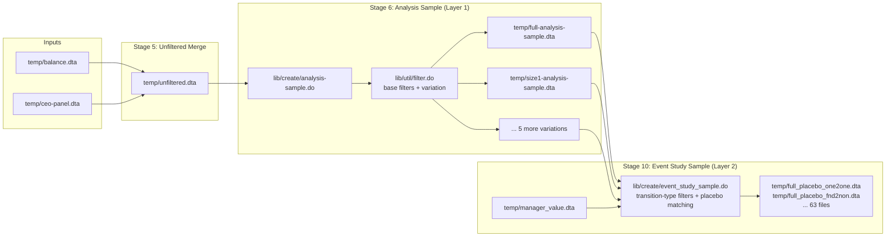

# Sampling and Filtering Subsystem

## Overview

The CEO Value Research Project uses a **two-layer hierarchical sampling system** to produce estimation-ready datasets. The first layer applies uniform quality/size filters plus a variation-specific subsample condition (via [`lib/util/filter.do`](repo://lib/util/filter.do) and [`lib/create/analysis-sample.do`](repo://lib/create/analysis-sample.do)). The second layer further restricts CEO transitions by type (via [`lib/create/event_study_sample.do`](repo://lib/create/event_study_sample.do)). The [`Makefile`](repo://Makefile) generates all combinations automatically.

**Rationale:** Each filter isolates different firm types or time periods for robustness, ensuring that reported results are not driven by a single subsample composition.

---

## Layer 1: Analysis-Sample Filtering (`filter.do` + `analysis-sample.do`)

### Entry Point

```makefile
temp/%-analysis-sample.dta: lib/create/analysis-sample.do temp/unfiltered.dta lib/util/filter.do
    $(STATA) $< $*
```

The Makefile pattern rule (line 63–64) substitutes `%` with each value from `ANALYSIS_VARIATIONS`:

```makefile
ANALYSIS_VARIATIONS := full size1 size2 size3 size4 pre2000 post2000
```

### Script: `analysis-sample.do`

[`lib/create/analysis-sample.do`](repo://lib/create/analysis-sample.do) is a thin wrapper:

1. Accepts a `sample` argument (one of `full`, `pre2000`, `post2000`, `size1`–`size4`).
2. Loads `temp/unfiltered.dta`.
3. Delegates all filtering to `lib/util/filter.do` with the sample argument.
4. Saves `temp/<variation>-analysis-sample.dta`.

### Script: `filter.do` — Uniform Base Filters

[`lib/util/filter.do`](repo://lib/util/filter.do) applies these **universal quality filters** (lines 21–82) before the variation-specific condition.

#### Filter Parameters

| Parameter | Default | Effect | Source Line |
|-----------|---------|--------|-------------|
| `max_ceos_per_year` | `2` | Firms that ever have more than this many CEOs in a single year are dropped. | 21 |
| `max_ceo_spells` | `12` | Firms whose maximum CEO-spell count exceeds this threshold are dropped. | 22 |
| `min_firm_age` | `1` | Firm-years with `firm_age < 1` (the incomplete first year) are dropped. | 23 |
| `excluded_sectors` | `"9"` | Sector codes to exclude (sector 9 = finance/insurance). | 24 |
| `min_employment` | `3` | Firms whose maximum employment ever stays below this threshold are dropped. | 25 |

A comment block (lines 27–52) documents the Hungarian legal-form codes (1–23) that correspond to sector codes, but the actual filter only excludes sector `"9"` (finance).

#### Base Filter Sequence

1. **Drop firm-years without a CEO** (`drop if ceo_spell == 0`). Line 54.
2. **Drop firms with > 2 CEOs per year**: compute `max_n_ceo` per firm, drop if it exceeds 2. Lines 57–61.
3. **Drop firms with > 12 CEO spells**: drop if `max_ceo_spell > 12`. Line 62.
4. **Drop incomplete first year**: drop if `firm_age < 1`. Lines 64–65.
5. **Drop finance sector**: drop if `inlist(sector, "9")`. Lines 67–69.
6. **Drop too-small firms**: drop if `max_employment < 3`. Lines 71–73.
7. **Drop observations missing key outcome variables**: `lnR`, `ROA`, `lnL`, `lnK`, `lnRL`, `export`. Lines 77–82.

#### Variation-Specific Subset

After the base filters, the script applies the condition for the requested `sample` (line 88):

```stata
keep if ``sample''
```

The variation definitions (lines 8–13):

| Variation | Condition | Purpose |
|-----------|-----------|---------|
| `full` | *(no condition)* | All observations passing base filters |
| `size1` | `employment <= 5` | Micro firms |
| `size2` | `employment > 5 & employment <= 10` | Very small firms |
| `size3` | `employment > 10 & employment <= 25` | Small firms |
| `size4` | `employment > 25` | Medium–large firms |
| `pre2000` | `year <= 2000` | Early period |
| `post2000` | `year > 2000` | Late period |

The accepted values are validated at line 16 with an assertion.

---

## Layer 2: Event Study Sample Filtering (`event_study_sample.do`)

### Entry Point

The Makefile generates a rule for every `(variation, sample)` pair:

```makefile
define GEN_PLACEBO
temp/$(1)_placebo_$(2).dta: lib/create/event_study_sample.do temp/$(1)-analysis-sample.dta temp/manager_value.dta
    $$(STATA) $$< $(1) $(2)
endef
$(foreach variation, $(ANALYSIS_VARIATIONS), $(foreach sample, $(SAMPLES), $(eval $(call GEN_PLACEBO,$(variation),$(sample)))))
```

The Makefile `SAMPLES` variable (line 14):

```makefile
SAMPLES := full one2one twos fnd2non non2non gender nogender gap nogap
```

### Script: `event_study_sample.do`

[`lib/create/event_study_sample.do`](repo://lib/create/event_study_sample.do) loads `temp/<variation>-analysis-sample.dta`, merges manager skill estimates and demographics, constructs firm-spell-level observations, and applies a **transition-type sample filter** (lines 112–115) before proceeding to placebo matching.

#### Sample Definitions (lines 5–17)

| Sample | Condition | Meaning |
|--------|-----------|---------|
| `full` | `1` (always true) | All clean transitions |
| `fnd2non` | `has_founder1 == 1 & has_founder2 == 0` | Founder CEO → non-founder CEO |
| `non2non` | `has_founder1 == 0 & has_founder2 == 0` | Non-founder → non-founder |
| `small` | `max_size == 1` | Small firms (max employment < 10) |
| `large` | `max_size == 2` | Large firms (max employment >= 10) |
| `one2one` | `n_ceo1 == 1 & n_ceo2 == 1` | Exactly one CEO in both spells |
| `twos` | `n_ceo1 == 2 \| n_ceo2 == 2` | Multi-CEO spell on either side |
| `gap` | `(n_ceo1 == 1 & n_ceo2 == 1) & (age_diff > 10)` | Single CEOs, large age gap |
| `nogap` | `(n_ceo1 == 1 & n_ceo2 == 1) & (age_diff <= 10)` | Single CEOs, small age gap |
| `gender` | `n_ceo_male1 != n_ceo_male2` | CEO gender changes between spells |
| `nogender` | `n_ceo_male1 == n_ceo_male2` | CEO gender unchanged |

**Note:** The script defines `small` and `large` (lines 11–12), but these are **not included** in the Makefile `SAMPLES` iterator. They are available for manual invocation but the automated build does not generate placebo files for them.

The valid samples are enumerated at line 20:

```stata
local valid_samples full fnd2non non2non small large one2one twos gap nogap gender nogender
```

### Additional Filters Applied Before the Sample Condition

The script imposes several structural requirements (lines 55–81) before the sample condition:

1. **Max CEOs per firm ≤ 2** (`max_n_ceo <= ${max_n_ceo}`). Line 59.
2. **Max CEO spell** filter: `ceo_spell <= max_ceo_spell`. Line 62.
3. **Non-missing ROA**. Line 63.
4. **Consecutive spells only**: drop single-spell firms and firms with non-consecutive spell numbering. Lines 80–84.
5. **Intermediate spell duplication**: each intermediate spell is duplicated so every transition appears as a separate before/after observation. Lines 87–100.
6. **Manager skill and minimum observations**: drop spells missing manager skill or with fewer than `min_T` (default 1) observations. Lines 77, 106.

---

## Makefile Combinatorics

The two layers produce a **7 × 9 = 63 combination** matrix (or 7 × 11 = 77 if including `small`/`large`).

| | `full` | `size1` | `size2` | `size3` | `size4` | `pre2000` | `post2000` |
|---|---|---|---|---|---|---|---|
| `full` | ✓ | ✓ | ✓ | ✓ | ✓ | ✓ | ✓ |
| `one2one` | ✓ | ✓ | ✓ | ✓ | ✓ | ✓ | ✓ |
| `twos` | ✓ | ✓ | ✓ | ✓ | ✓ | ✓ | ✓ |
| `fnd2non` | ✓ | ✓ | ✓ | ✓ | ✓ | ✓ | ✓ |
| `non2non` | ✓ | ✓ | ✓ | ✓ | ✓ | ✓ | ✓ |
| `gender` | ✓ | ✓ | ✓ | ✓ | ✓ | ✓ | ✓ |
| `nogender` | ✓ | ✓ | ✓ | ✓ | ✓ | ✓ | ✓ |
| `gap` | ✓ | ✓ | ✓ | ✓ | ✓ | ✓ | ✓ |
| `nogap` | ✓ | ✓ | ✓ | ✓ | ✓ | ✓ | ✓ |

Each output file is named `temp/<variation>_placebo_<sample>.dta` and is declared `.PRECIOUS` (Makefile lines 24, 29, 32).

---

## Data Flow Summary



---

## Key Design Decisions

1. **Two-stage separation**: Quality/size filters are applied early (once per variation) and saved to disk. Transition-type filters are applied during placebo construction, avoiding redundant re-filtering.

2. **Base filters are uniform**: All variations share the same `max_ceos_per_year=2`, `max_ceo_spells=12`, `min_firm_age=1`, `excluded_sectors="9"`, and `min_employment=3`. Only the last `keep if` condition differs. This ensures comparability across subsamples.

3. **`min_employment=3` is the economic relevance threshold**: The README states that "the analysis focuses on economically meaningful firms by excluding those that never reach 5 employees during their lifetime," but the code actually uses a cutoff of 3 (`min_employment=3`). The comment at line 25 notes "cutoff values 2,3,5" as alternatives, indicating this parameter is tunable.

4. **`SAMPLES` vs. `valid_samples` discrepancy**: The Makefile `SAMPLES` variable omits `small` and `large` even though [`event_study_sample.do`](repo://lib/create/event_study_sample.do#L11-L12) defines them. These samples exist in the code but are not generated by the automated build. They can be invoked manually:
   ```bash
   stata -b do lib/create/event_study_sample.do full small
   ```

5. **All outputs are `.PRECIOUS`**: The Makefile marks every intermediate file (lines 24–29) as precious, preventing `make` from deleting them after downstream targets complete.

---

## Related Pages

- [/openwiki/architecture/data-pipeline.md](/openwiki/architecture/data-pipeline.md) — Stage 6 (analysis sample) and Stage 10 (event study sample) in the pipeline context.
- [/openwiki/operations/runtime-parameters.md](/openwiki/operations/runtime-parameters.md) — All configurable parameters, including filter settings and Makefile iterators.
- [/openwiki/workflows/placebo-construction.md](/openwiki/workflows/placebo-construction.md) — Downstream placebo matching that consumes the filtered samples.
- [/openwiki/workflows/full-build.md](/openwiki/workflows/full-build.md) — End-to-end build that orchestrates sampling and estimation.
